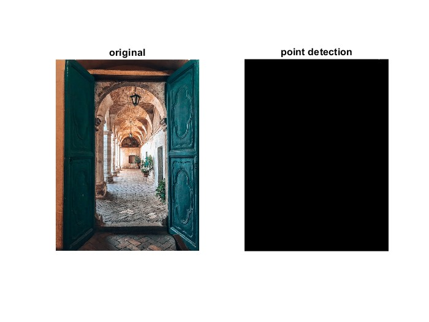

<b>工作周报</b>

<i>(06/13 - 06/19)</i>

<b>目录<b>
[toc]

## 工作内容
本周工作主要是对数字图像处理相关原理进行熟悉。在本周的图像处理中，使用的编程语言是Matlab。选择该编程语言的主要原因是Matlab在数字图像处理方面有专门的函数以及专门的工具箱（Image Processing Toolbox）来完成对应的图像处理任务，在编程方面更加便捷。下面将根据学习计划中的内容逐一展示结果并解释相关原理。
### 灰度变换
在本次任务中主要是通过RGB中三种颜色通道信号拟合成最后的灰度图，拟合所使用的公式如下：
GR = 0.299 * R + 0.58700 * G + 0.11400 * B
|参数名|含义|示例|
|:----:|:----|:----|
|O|原图|`O = imread('door.jpeg')`|
|R|原图红通道信号|`R = O(:,:,1)`|
|G|原图绿通道信号|`G = O(:,:,2)`|
|B|原图蓝通道信号|`B = O(:,:,3)`|
|GR|灰度图|`GR = rgb2gray(O)`|
通过Matlab得到的图像如下：

代码：[Gray-Scale](https://github.com/yezehao/Visual_measurement/blob/main/week1/gray_scale.m)

### 直方图
灰度直方图是描述图像中每种灰度像素的个数，在已经得到灰度图的情况下，直接根据该图像生成直方图即可。得到的结果如下：

代码：[Histogram](https://github.com/yezehao/Visual_measurement/blob/main/week1/Histogram.m)

### 空间滤波  
空间滤波根据卷积核对图像进行相应的处理。卷积核是一个<i>NxN</i>的矩阵，N为大于1的奇数。通过核子的不同又可以将空间滤波分为线形空间滤波和非线形空间滤波。

### 滤波器——图像平滑
图像平滑主要是通过滤波器进行模糊处理。这里使用了两种滤波器来完成图像平滑。分别为均值滤波器和高斯滤波器。
+ 均值滤波器
  均值滤波器是一种低通滤波器，只是简单的把邻域内的平均值赋给中心元素。结果如下：
  
  代码：  [Average_Blur](https://github.com/yezehao/Visual_measurement/blob/main/week1/average_blur.m)

+ 高斯滤波器
  高斯滤波器也是一种低通滤波器，不同的是他在这里使用了高斯分布以期达到更好的模糊效果。
    
  代码：  [Gaussian_Blur](https://github.com/yezehao/Visual_measurement/blob/main/week1/gaussian_blur.m)

### 频域滤波
频域滤波主要是通过傅里叶变换后将原来的卷积核变为简单的相乘，减少了运算量，可以对图像更加精确的处理。频域滤波大致可以分为理想滤波器，高斯滤波器，布特沃斯滤波器和梯形滤波器四种。

### 边缘检测算子与图像锐化
图像锐化实际上是补偿图像的轮廓，增强图像的边缘及灰度跳变的部分，使图像变得清晰。因此图像锐化这一任务可以看成将边缘检测后得到的图像以一定的加权合成到原图上生成新的图像。
#### Sobel算子及锐化（灰度图）

[Sobel Edge Dection with sharpen](https://github.com/yezehao/Visual_measurement/blob/main/week1/sobel_sharpen.m)
#### Robert算子及锐化（灰度图）

代码：[Robert Edge Detection with sharpen](https://github.com/yezehao/Visual_measurement/blob/main/week1/robert_sharpen.m)
#### Perwitt算子及锐化（灰度图）

代码：[Perwitt Edge Detection with sharpen](https://github.com/yezehao/Visual_measurement/blob/main/week1/prewitt_sharpen.m)
#### Canny算子（灰度图）

代码：[Canny Edge Detection with sharpen](https://github.com/yezehao/Visual_measurement/blob/main/week1/canny_sharpen.m)
由于canny算子得到的边缘检测图数据结构为logical，没有办法直接和原图产生的灰度图相加，因此这里没有通过这种算法进行锐化。后续可以通过转化数据结果并且乘以特定加权值来生成锐化图。

### 图像分割 
#### 点检测
在点检测中直接用了一个3x3的矩阵来探测点。算法中虽然使用了sobel算子先对图像进行了处理以更好的检测点，最终的结果图仍然为全黑。

代码：[Point Detection](https://github.com/yezehao/Visual_measurement/blob/main/week1/point_detection.m)

#### 线检测
线检测使用了霍夫变换来检测直线，并且使用了一种相对较成熟的算法来得到相对理想结果。

代码：[Line Detection with Hough Transform](https://github.com/yezehao/Visual_measurement/blob/main/week1/hough_line.m)
reference:[使用霍夫变换检测直线](http://matlab.izmiran.ru/help/toolbox/images/enhanc11.html)

#### 边缘检测
边缘检测的内容见`边缘检测算子与图像锐化`中的代码及结果

### 形态学处理
形态学处理部分的代码：[morphology with gray-scale image](https://github.com/yezehao/Visual_measurement/blob/main/week1/morphology_gray.m)
#### 腐蚀/膨胀

#### 开闭运算

#### 顶帽/底帽操作

