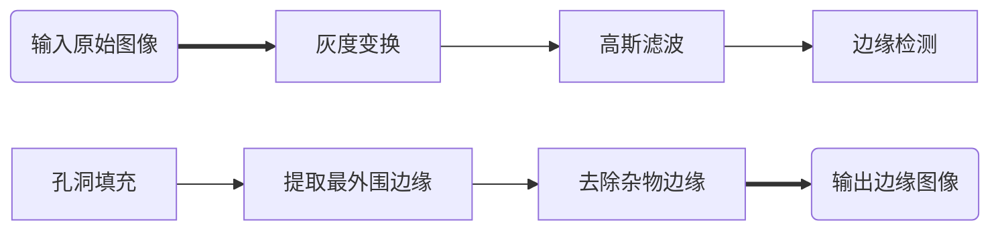
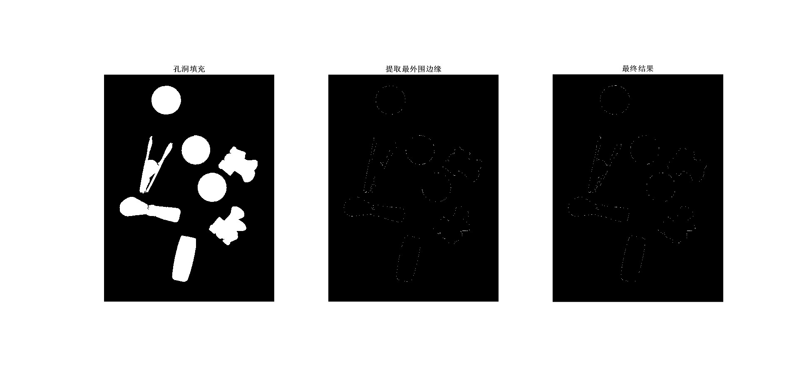
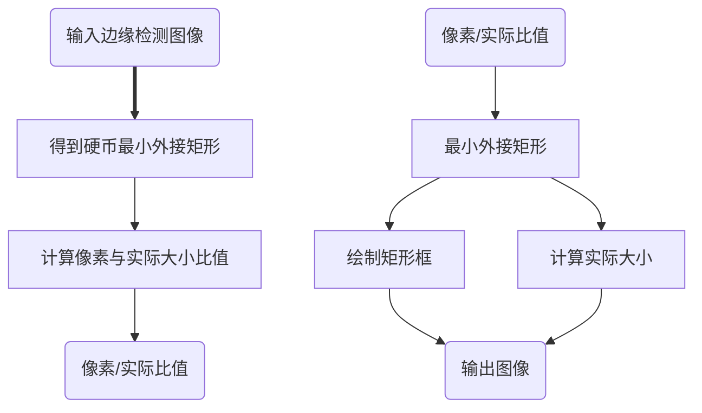

<center><font size=8><b>工作周报</b></font></center>
<center><font size = 4><i>(week 2)</i></font></center>


## 尺寸测量
在《[基于opencv进行的尺寸测量](https://pyimagesearch.com/2016/03/28/measuring-size-of-objects-in-an-image-with-opencv/)》一文中，作者将尺寸测量拆分成以下三个步骤，分别为：
+ 边缘检测与补全
+ 根据图像像素大小计算实际物体大小
+ 结果输出到原图


本次图像处理也大致依照这一流程进行。

### 边缘检测与补全
在这部分中，原文使用在读取原图信息后先后对图像进行了灰度转换，高斯滤波，Canny算子边缘检测,孔洞填充,提取最外围边缘,去除杂物边缘。流程图如下：

但在处理图像时，使用canny算子得到的结果出现了一些问题。具体结果如下：


六张图对应的是进行六次操作后得到的结果，可以看出，在使用canny算子进行边缘检测时，除了最下面的物品外没有办法得到一个完整的边缘，因此在孔洞填充时就没有办法进行填充。Canny算子边缘检测的算法如下：
+ <i>Edge Detection</i>
```
gr = rgb2gray(O);% gray scale
G = fspecial('gaussian', [11,11], 1);% create Gaussian filter
gaussian = imfilter(gr,G,'replicate');% gaussian blur
canny = edge(gaussian,'canny',0.1);% canny edge detection

figure,% plot figure
subplot(1,3,1);imshow(gr);title('灰度图');
subplot(1,3,2);imshow(gaussian);title('高斯模糊');
subplot(1,3,3);imshow(canny);title('CANNY边缘检测');
```
+ <i>Remove miscellaneous</i>
```
filling=imfill(binary,'holes');% flood filling         
edge_b=bwperim(filling);% binary image edge detection
output=bwareaopen(edge_b,150);% remove objects smaller than 150 px

figure,% plot figure
subplot(1,3,1);imshow(filling);title('孔洞填充');
subplot(1,3,2);imshow(edge_b); title('提取最外围边缘');
subplot(1,3,3);imshow(output);title('去除杂物边缘');
```
为了解决这一问题，在本次图像处理中没有使用canny算子，而是将图像在灰度变换后膨胀，将膨胀后的图像直接二值化得到如下的结果。

关于二值化的代码如下：
```
gr = rgb2gray(O);% gray scale;
SE = strel('square',9);
bw = imdilate(gr,SE);
binary = imbinarize(bw);

figure,% plot figure
subplot(1,3,1);imshow(gr);title('灰度图');
subplot(1,3,2);imshow(bw);title('膨胀');
subplot(1,3,3);imshow(binary);title('二值化');
```
在经过孔洞填充，二值化图片边缘检测等操作后，最终得到的结果如下：

关于孔洞填充，二值化图片边缘检测的代码如下：
```
edge1=bwperim(binary);% binary image edge detection
filling=imfill(edge1,'holes');% flood filling
edge2=bwperim(filling);% binary image edge detection
output=bwareaopen(edge2,150);% remove objects smaller than 150 px

figure,% plot figure
subplot(1,3,1);imshow(filling);title('孔洞填充');
subplot(1,3,2);imshow(edge2); title('提取最外围边缘');
subplot(1,3,3);imshow(output);title('去除杂物边缘');
```
到这一阶段边缘检测与补全的任务顺利完成。


### 根据图像像素大小计算实际物体大小
+ <i>参照物在图像中像素大小与实际大小比对</i>
  在程序中，通过调用minboundrect函数来得到最小外接矩形，通过矩形的大小得到硬币在图像中的像素大小，并且通过像素大小和硬币实际大小的比值计算得到pixels per metric ratio。计算得到的值最后会用在其他物品的测量上。

+ <i>其他物品像素大小测量与实际大小计算</i>
  通过minboundrect和minboxing函数得到其他物体的最小外接矩形，并且通过pixels per metric ratio 计算这些物体的实际大小。

调用函数：[minbounderct函数](https://github.com/yezehao/Visual_measurement/blob/main/week2/minboundrect.m)，[minboxing函数](https://github.com/yezehao/Visual_measurement/blob/main/week2/minboxing.m)
主函数： [size-measurement](https://github.com/yezehao/Visual_measurement/blob/main/week2/sizemeausrement.m)


具体流程图如下：



最后得到的结果如下：


