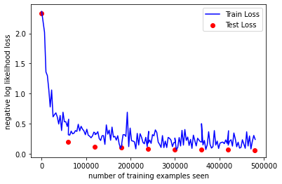
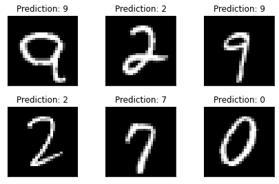
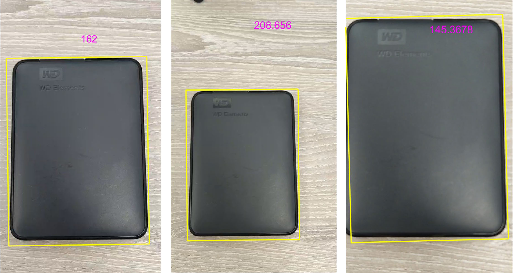

<center><font size=8><b>工作周报</b></font></center>
<center><font size = 4><i>(week 3)</i></font></center>

<font size = 5><b>目录<b></font>
[toc]

# 手写识别

### <font size = 5> ENVIRONMENT </font>
在运行手写识别有关代码前，需要先安装conda并且建立一个conda虚拟环境。命令如下：
` conda create -n pytorch python=3.9`
在建立虚拟环境后激活该环节，并在环境中安装相关python库。激活命令如下：
`conda activate pytorch`
安装python相关库的命令如下：
```
conda install pytorch torchvision torchaudio cudatoolkit=10.2 -c pytorch
conda install -n pytorch ipykernel --update-deps --force-reinstall
conda install -c conda-forge matplotlib
conda install pandas
conda install scikit-learn
```
### <font size =5>程序</font>

基于MNIST数据库训练手写识别的程序如下：
[用pytoch通过MNIST数据库实现手写识别](https://github.com/yezehao/Visual_measurement/blob/main/week3/pytorch/pytorch_MNIST.ipynb)

在该程序中，并没有使用相对复杂的卷积神经网络，只是简单使用了两个二维卷积层，并且直接和两个线性层连接组成最后的神经网络。理论上来说，这里直接使用LeNet效果会更好，最终结果会更快收敛，但是使用简单的神经网络计算量更少，学习一个周期的时间更短。
`````
Net(
  (conv1): Conv2d(1, 10, kernel_size=(5, 5), stride=(1, 1))
  (conv2): Conv2d(10, 20, kernel_size=(5, 5), stride=(1, 1))
  (conv2_drop): Dropout2d(p=0.5, inplace=False)
  (fc1): Linear(in_features=320, out_features=50, bias=True)
  (fc2): Linear(in_features=50, out_features=10, bias=True)
)
`````

### <font size =5>结果</font>
在经过八次epoch的训练后，准确率的变化如下表所示：

| Epoch | Test Loss | Accuracy (number) | Accuracy (%) |
| :---: | :-------: | :---------------: | :----------: |
| 1 | 0.1903 | 9421/10000 | 94% |
| 2 | 0.1199 | 9622/10000 | 96% |
| 3 | 0.0987 | 9693/10000 | 97% |
| 4 | 0.0826 | 9749/10000 | 97% |
| 5 | 0.0715 | 9770/10000 | 98% |
| 6 | 0.0636 | 9799/10000 | 98% |
| 7 | 0.0648 | 9800/10000 | 98% |
| 8 | 0.0576 | 9817/10000 | 98% |

`````
Test set: Avg. loss: 0.1903, Accuracy: 9421/10000 (94%)
Test set: Avg. loss: 0.1199, Accuracy: 9622/10000 (96%)
Test set: Avg. loss: 0.0987, Accuracy: 9693/10000 (97%)
Test set: Avg. loss: 0.0826, Accuracy: 9749/10000 (97%)
Test set: Avg. loss: 0.0715, Accuracy: 9770/10000 (98%)
Test set: Avg. loss: 0.0636, Accuracy: 9799/10000 (98%)
Test set: Avg. loss: 0.0648, Accuracy: 9800/10000 (98%)
Test set: Avg. loss: 0.0576, Accuracy: 9817/10000 (98%)
`````



最后的识别准确率大致能达到为98%左右，想要进一步提高准确率就需要构建更优的神经网络或者使用一些技巧来促进神经网络更加收敛。

最后，给出关于手写识别示例作为参考：



### <font size = 5> REFERENCE </font>

#### Pytorch 

[linear Neural Network](https://medium.com/analytics-vidhya/training-mnist-handwritten-digit-data-using-pytorch-5513bf4614fb)

[LeNet5 Neural Network](https://blog.paperspace.com/writing-lenet5-from-scratch-in-python/)

[simple CNN](https://nextjournal.com/gkoehler/pytorch-mnist)

#### D2L

[LIMU_d2l](https://github.com/d2l-ai/d2l-zh), [install d2l(limu)](https://zh.d2l.ai/chapter_installation/index.html)


# 单目测距
传统的测距主要是使用激光测距仪，如VL53L1X距离感应器，依据TOF原理进行测距，但是使用这种方式测距意味着机器人需要额外安装一个激光测距仪，会相应的增加机器人的信息处理量。因此使用镜头得到的数据进行处理可以提高信息的利用率。

### 参数设定

+ 这里使用移动硬盘作为标准，移动硬盘的尺寸为：110.49mm x 82.04mm x 15.24mm。
+ 在初始测量时摄像头距离硬盘的距离为162mm, 根据以下的信息，在得到硬盘在视频中的像素大小可以计算出摄像头距离硬盘的距离，达到单目测距的目标。
+ 视频的参数为720 x 1280, 30fps

### 原理

物体在作为参考的第一帧中的像素大小与实际大小呈等比例关系，设该比率为$R_0$。那么可以计算得到：
<font size = 5><center>$
R_0^2 = \frac {Area_{real}}{Area_{pixel}} 
$</center></font>

这时镜头与目标的距离产生变化，物体在视觉中大小产生了变化，这就导致了物体的像素大小和实际大小比例产生了变化，比率变为$R_f$.
<font size = 5><center>$ 
R_f^2 = \frac {Area_{real}}{Area_{frame}} 
$</center></font>

同时由于镜头的焦距在移动过程中没有变化，镜头与硬盘的垂直距离$D$与采集到图像的对角线长度之间的比值是不变的，对角线的长度可以由每一帧图像的大小乘以前面的比率$R_0$和$R_f$计算得出。由此可以列出如下等式：

<font size = 5><center>$
\frac {\sqrt {(720*R_0)^2+(1280*R_0)^2}}{D_{initial}} = \frac {\sqrt {(720*R_f)^2+(1280*R_f)^2}}{D_{initial}+ \Delta d}
$</center></font>

根据以上等式可以得出距离的变化量与两个比率之间的关系：

<font size = 5><center>$
\Delta d = D_{initial} * \frac{R_f - R_0}{R_0}
$</center></font>

### 程序
+ 输入已知变量;
  ```
  % The size of portabel hard disk is: 
  % 110.49mm x 82.04mm x 15.24mm
  real_area = 110.49 * 82.04; 
  
  % initial distance
  init_dis = 162; % unit is mm
  ```

+ 在根据第一帧的图像计算得到$R_0$;
  ```
  %% Check the pixel of first frame
  frame1 = read(obj,1);
  % process first frame
  gaussian = imfilter(rgb2gray(frame1), fspecial('gaussian',9), 'replicate');
  canny=edge(imbinarize(gaussian),'Canny');
  filling = bwperim(imfill(canny,'holes')); 
  bw = imdilate(bwareaopen(filling,800),strel('disk',5));

  % find rectangle
  [labelpic,num] = bwlabel(bw,4);
  [r, c]=find(labelpic==1);
  [rectx,recty,area,perimeter]=minboundrect(c,r,'p');
  [length, width] = minboxing(rectx(1:end-1),recty(1:end-1));

  % Plot figure
  figure,imshow(frame1);
  line(rectx,recty,'color','y','linewidth',2);
  text(360,200,num2str(init_dis),'Color','m','FontSize',18);
  close;

  %% Calculation
  pixel_area1 = length * width;
  rate = sqrt(real_area/pixel_area1);
  ```
+ 通过循环计算$R_f$
  这部分没有展示图像处理的代码，与上面处理第一帧的代码类似。同时本次图像处理选择每四帧处理一帧以减少处理时的工作量。
  ```
    % calculate distance
    pixel_area = length * width;
    rate_frame = sqrt(real_area/pixel_area);
    delta_d = init_dis*(rate_frame-rate)/rate;
    distance = init_dis + delta_d;
    text(360,200,num2str(distance),'Color','m','FontSize',18);
  ```

完整程序如下：
[单孔测距](https://github.com/yezehao/Visual_measurement/blob/main/week3/monocular/monocular.m)

### 结果
这里分别展示了第一帧，第32帧，第116帧处理后的图像。
