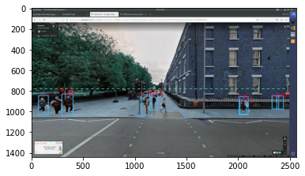
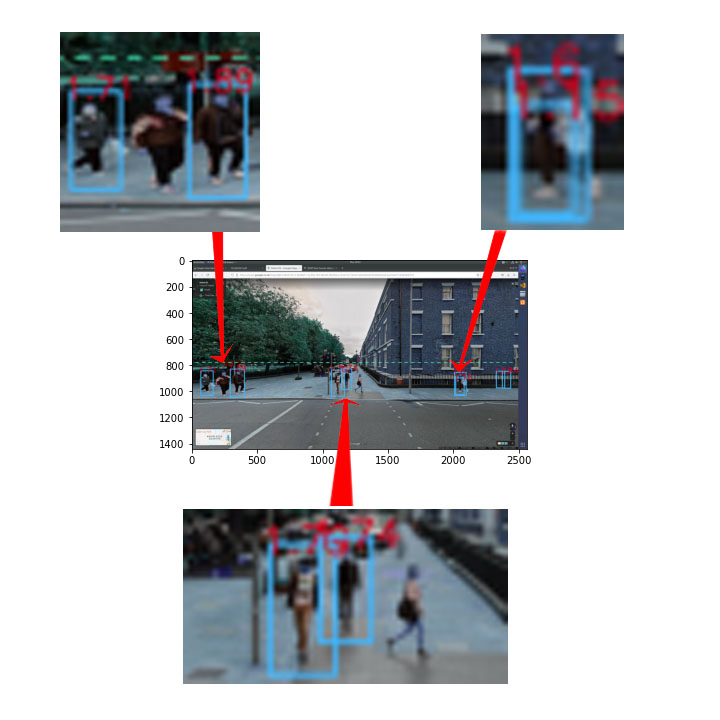

<center><font size=8><b>工作周报</b></font></center>
<center><font size = 4><i>(week 3)</i></font></center>

<font size = 5><b>目录<b></font>
[toc]

# 环境

本周的计算机视觉任务可以被划分为两个子任务，分别是：
+  OpenCV-Object-Detection
+ Object-Height-Calculation
因此在搭建环境时也需要使用相应的python库，可以根据下面的命令来搭建环境（该环境中需要有conda, 且开发在ubuntu中进行）。

#### 创建并启动虚拟环境
```
conda create -n monocular python=3.9
conda activate monocular
mkdir monocular
```

#### 安装juypter
```
conda install -c conda-forge jupyter
```

#### 安装相应python库
```
conda install -c conda-forge opencv
conda install -c conda-forge imutils
conda install -c conda-forge matplotlib
```
这里使用了imutils这个库是因为该库中有现成的有关人体识别函数，在程序中可以直接调用HOG与Linear SVM完成人体识别。但是本程序中没有使用NMS，因为使用的图片有人像的重叠，可能会导致部分人像无法完全检测。

# 原理及相机参数
## 原理
原文中有公式的推导，在$cos(\theta) ≈ 1$, $sin(\theta) ≈ \theta$, $(v_c − v_0) ×
(v_c − v_0)/f^2 ≈ 0$的情况下，可以将物体的高度通过以下等式计算。

<font size = 4.5><center>$
h_{obj} = h_{cam} * \frac {v_t − v_b}{v_0 − v_t} 
$</center></font>

因此，想要计算物体的高度，需要知道相机的高度$h_{obj}$以及相机的焦距（镜头角度）。为了方便计算，这里选用了谷歌地图中的街景图像作为参考来进行计算。

## 相机参数
谷歌地图的街景图像相比于一般拍摄的镜头有三点优势。
+ 首先，谷歌的街景图可以保证不存在滚转角，符合了论文中的要求。
+ 其次，谷歌地图使用专门的取景车取景，保证了在取景时的高度固定为 8.2 feet (2.4936 m)，取景车的图像如下：


+ 最后，谷歌地图的取景镜头焦距固定为5.1 mm, 可以比对表格得出相应的取景镜头的角度大致为 94 &deg;。

|focal length of 5700|35mm equivalent|	Angle of View (degree)|
|:---:|:---:|:---:|
|4.3mm|17mm|104
|<font color = #FF0000>5.1mm</font>|20mm|<font color = #FF0000>94</font>
|6.1mm|24mm|84
|7.1mm|28mm|75
|8.9mm|35mm|63
详情见网页中的内容：[relationship between focal length & angle](https://pages.mtu.edu/~shene/DigiCam/User-Guide/5700/ON-CAMERA-LENS/overview.html)

# 结果及分析
代码如下：[Single-View-Metrology](https://github.com/yezehao/Visual_measurement/blob/main/week4/monocular/metrology.ipynb)，最终的结果如图：

其中绿色代表的是相机在图中的等效高度，蓝色方框代表的是识别到的人，红色数字代表计算后的高度。这里附上一张部分放大后的图像以便分析。


首先这张图相对原图来说很模糊，很有可能实在展示图片时选择的是以matplotlib的方式展示的，造成了这种结果。

其次可以看出，这里的结果与实际有较大的偏差。识别人体的算法没有将所有的人体都识别出来，甚至将栏杆识别为了人体，这意味着想要准确的识别人体不能简单的使用imutils的库，需要修改一些参数。同时，标注人体时矩形并未完全按照人体边缘标注，这里可以看到左上角的放大图中两个人分别被标注为1.71 m 和 1.89 m，这和实际的身高差距较大。但是下方的放大图中两个人的身高标注则相对正常。右上角的图中则一个人标注了两次，较大的矩形框数据与实际身高大致相符，想要改进可以使用NMS来优化算法。

最后，根据图片以及相机的信息可以得出相机在拍摄该角度图时的俯仰角约为 5.10662 &deg;（这里认为俯角为负，仰角为正），直接套用论文中计算物体高度的公式其实与公式的条件之间略有不符，因此最好的办法是在谷歌地图街景中手动调整相机角度以谋求更适合的图像。

总的来说，该程序只是勉强能够运行，距离论文的效果还有更大的提升空间。

# REFERENCE
[paper](https://www.ecva.net/papers/eccv_2020/papers_ECCV/papers/123560307.pdf)，[website](https://jerrypiglet.github.io/ScaleNet/)，[github](https://github.com/suraj-maniyar/Single-View-Metrology)